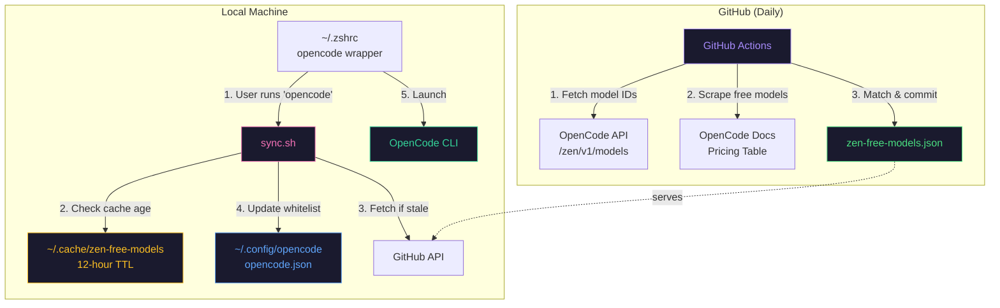

# OpenCode Zen Free Models Sync

Automatically sync your local OpenCode configuration with only free Zen models.

## Overview

This system has two parts:

1. **Remote scraper** (GitHub Actions): Runs daily to scrape OpenCode Zen docs for free models and publishes `zen-free-models.json`
2. **Local sync** (shell script): Fetches the JSON and updates your OpenCode config to whitelist only free models

## Architecture



## Free Models (Current)

- `big-pickle`
- `glm-4.7-free`
- `gpt-5-nano`
- `grok-code`
- `minimax-m2.1-free`

## Requirements

- **macOS, Linux, or WSL**
- **Node.js** (for JSON config updates)
- **curl** (for fetching from GitHub API)
- **Bash or Zsh** (for shell wrapper function)

> **WSL users:** Install dependencies with `sudo apt install nodejs curl` if not already installed.

## Quick Start

### Option A: Clone the repo (recommended for developers)

```bash
# Clone the repo
git clone https://github.com/VcDoc/zen-free-models.git ~/Developer/zen-free-models

# Create symlink to sync script
mkdir -p ~/.local/share/zen-free-models
ln -sf ~/Developer/zen-free-models/scripts/sync.sh ~/.local/share/zen-free-models/sync.sh
```

This way, `git pull` updates your sync script automatically.

### Option B: Download script only

```bash
# Create directory
mkdir -p ~/.local/share/zen-free-models

# Download sync script
curl -o ~/.local/share/zen-free-models/sync.sh \
  https://raw.githubusercontent.com/VcDoc/zen-free-models/main/scripts/sync.sh

# Make executable
chmod +x ~/.local/share/zen-free-models/sync.sh
```

### 2. Add shell function to your shell's rc file

Add to `~/.zshrc` (Zsh) or `~/.bashrc` (Bash):

```bash
# opencode wrapper - syncs zen free models before launching
opencode() {
  ~/.local/share/zen-free-models/sync.sh 2>&1
  command opencode "$@"
}

# Force refresh - clears cache and re-syncs before launching
alias opencode-refresh='rm -f ~/.cache/zen-free-models/models.json && opencode'
```

Then reload your shell config:
```bash
source ~/.zshrc   # or source ~/.bashrc
```

### 3. Use normally

```bash
opencode
```

The wrapper will:
1. Check if cache is valid (12-hour TTL)
2. Fetch latest free models from GitHub if needed
3. Update `~/.config/opencode/opencode.json` with whitelist
4. Launch OpenCode

## How It Works

### Remote Scraper (GitHub Actions)

- Runs daily at 05:00 UTC
- Fetches model list from `https://opencode.ai/zen/v1/models` API
- Scrapes pricing table from `https://opencode.ai/docs/zen/` using Stagehand
- Matches free models (both input and output are "Free") to API model IDs
- Commits `zen-free-models.json` if changed

### Local Sync Script

- Uses 12-hour cache to minimize API calls
- Fetches from GitHub API (avoids CDN caching issues)
- Updates `~/.config/opencode/opencode.json`:
  - Sets `provider.opencode.whitelist` with free model IDs
  - Preserves all other config (MCP servers, other providers, etc.)
- If no free models available, disables the opencode provider

## Repository Structure

```
zen-free-models/
├── .github/workflows/
│   └── update.yml                   # Daily scraper workflow
├── scraper/
│   ├── src/
│   │   ├── index.ts                 # Stagehand scraper
│   │   ├── matching/index.ts        # Model name matching logic
│   │   └── utils/                   # Config, logger, types
│   ├── tests/
│   │   ├── output.test.ts           # Output validation tests
│   │   └── matching.test.ts         # Matching unit tests
│   ├── package.json
│   └── tsconfig.json
├── scripts/
│   └── sync.sh                      # Local sync script (download this)
├── LICENSE                          # MIT License
├── zen-free-models.json             # Generated output (don't edit)
└── README.md
```

## For Developers

### Prerequisites

- Node.js 24+ (use fnm/nvm with `.nvmrc`)
- pnpm 10+ (via Corepack)
- Browserbase account (for Stagehand)
- OpenAI API key (for Stagehand's LLM extraction)

### Run Scraper Locally

```bash
# Install dependencies
pnpm install

# Set environment variables
export BROWSERBASE_API_KEY=your_key
export BROWSERBASE_PROJECT_ID=your_project_id
export OPENAI_API_KEY=your_openai_key

# Run scraper
pnpm scrape

# Run tests
pnpm test
```

### GitHub Actions Secrets Required

Add these as **Repository secrets** (Settings → Secrets and variables → Actions → Repository secrets):

| Secret | Description |
|--------|-------------|
| `BROWSERBASE_API_KEY` | Browserbase API key |
| `BROWSERBASE_PROJECT_ID` | Browserbase project ID |
| `OPENAI_API_KEY` | OpenAI API key for Stagehand extraction |

### Trigger Manual Update

1. Go to **Actions** tab on GitHub
2. Select **Update Zen Free Models** workflow
3. Click **Run workflow**

## Troubleshooting

### Models not updating

Use the `opencode-refresh` alias to force a cache refresh:

```bash
opencode-refresh
```

Or manually clear the cache:

```bash
rm -f ~/.cache/zen-free-models/models.json
opencode
```

### Check current config

```bash
cat ~/.config/opencode/opencode.json | jq '.provider.opencode'
```

### Verify models available

```bash
opencode models opencode
```

### GitHub Action fails

- Check Actions tab for error logs
- Verify all secrets are set correctly
- Ensure OpenCode Zen docs page structure hasn't changed

### Browserbase Errors

**"Browserbase quota exceeded"**
- Check your Browserbase dashboard for usage limits
- The scraper uses one session per run (daily)
- Consider upgrading your plan if hitting limits

**"Session failed to initialize"**
- Verify `BROWSERBASE_API_KEY` and `BROWSERBASE_PROJECT_ID` are correct
- Check Browserbase status page for outages
- Try running again (transient errors are retried automatically)

### OpenAI API Errors

**"OPENAI_API_KEY environment variable is not set"**
- Ensure you've added `OPENAI_API_KEY` to your `.env` file or GitHub secrets
- The LLM is used for both Stagehand extraction and model name matching

**"OpenAI API error (429)"**
- Rate limit exceeded - the scraper will retry with exponential backoff
- If persistent, check your OpenAI usage limits

**"OpenAI API error (401)"**
- Invalid API key - verify your key is correct and active

### LLM Matching Issues

**"LLM returned no matches"**
- The scraper will use known mappings as fallback
- Check if model names have changed on the pricing page
- Consider adding explicit mappings to `MAPPINGS` in `scraper/src/matching/index.ts`

**LLM call failed / Skipped unmatched models**
- Check your OPENAI_API_KEY is valid and has sufficient quota
- The scraper will continue with models that were successfully matched via mappings
- Consider adding explicit mappings for models that fail consistently
- Check logs for specific error details

### Sync Script Issues

**"Neither jq nor Node.js available"**
- Install either `jq` or Node.js for JSON parsing
- On Ubuntu: `sudo apt install nodejs` or `sudo apt install jq`
- On macOS: `brew install node` or `brew install jq`

**Cache always refreshing**
- Check if `ZEN_CACHE_MAX_AGE` is set too low
- Default is 12 hours (43200 seconds)

### API Rate Limits

The sync script uses the GitHub API without authentication:
- **Limit:** 60 requests/hour per IP
- **Default cache:** 12 hours (well within limits)
- Increase cache time if hitting limits: `export ZEN_CACHE_MAX_AGE=86400` (24 hours)

## Code Quality

This project includes automated code quality checks:
- **ESLint**: Linting with TypeScript support
- **Prettier**: Code formatting
- **npm audit**: Automated vulnerability scanning
